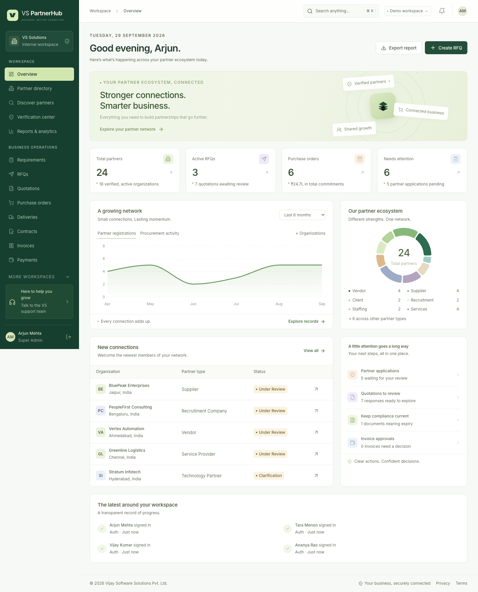

# VS PartnerHub

Partner management, procurement and recruitment for **Vijay Software Solutions Pvt. Ltd.**

A working application with persistent data, company verification, organization-scoped permissions and connected business workflows. Built from `VS_PartnerHub_Enterprise_Product_Documentation (1).docx` and the accompanying product requirements.



## Run locally

Use Node.js **22.21 or newer** and npm. No external database or email account is needed for the local demo.

```sh
npm ci
cp .env.example .env
npm run dev
```

Open **http://localhost:5173**. The API runs on port 4000. Migrations and fictional demo records are created automatically on first start. Data persists in `data/partnerhub.sqlite`; documents persist in `uploads/`.

At **[/login?demo=true](http://localhost:5173/login?demo=true)**, choose a role and click **Explore workspace**. The dropdown covers all nine organization types and seven internal teams. All demo accounts use `PartnerHub@2026`.

| Workspace          | Demo email                       |
| ------------------ | -------------------------------- |
| Super Admin        | `admin@vs.example`               |
| Buyer              | `buyer@acme.example`             |
| Vendor             | `vendor@nexora.example`          |
| Supplier           | `supplier@meridian.example`      |
| Recruitment        | `recruiter@talentbridge.example` |
| Staffing           | `staffing@flexforce.example`     |
| Service provider   | `services@aster.example`         |
| Technology partner | `technology@cloudcraft.example`  |
| Verification       | `verification@vs.example`        |
| Procurement        | `procurement@vs.example`         |
| Finance            | `finance@vs.example`             |
| HR                 | `hr@vs.example`                  |
| Management         | `management@vs.example`          |
| Support            | `support@vs.example`             |

The authoritative account list, including business partner and other organization personas, is in [shared/demo.ts](shared/demo.ts). Automatic demo seeding, the role chooser and on-screen verification codes are disabled when `NODE_ENV=production`. Use a fresh database for production.

## Included workspaces

- **Onboarding and compliance:** nine organization types, tailored business fields, contact role, private documents, email verification, VS approval, clarification, rejection, suspension, renewal and expiry reminders.
- **Procurement:** requirements, verified partner discovery, invited RFQs, line-item quotations, comparison, approval, purchase orders, acknowledgment, delivery confirmation, contracts, invoices and payment tracking.
- **Recruitment and staffing:** hiring requirements, assigned recruitment partners, candidate consent, submissions, screening, shortlisting, interviews and feedback, offers, BGV status, joining, engagements and timesheets.
- **Partner operations:** product/service/technology catalogs, SKU, specifications, MOQ, availability, pricing, delivery locations, rate cards, supporting documents, service milestones, technology demos and performance reviews.
- **Administration:** role-specific dashboards, team invitations, configurable permissions, reports and CSV exports, audit records, in-app notifications, SMTP outbox, settings and support conversations.

Commercial totals are calculated on the server in integer minor units. Approved quotes determine PO prices; fulfilled orders or active contracts determine invoices. Concurrent payments cannot reserve more than the invoice balance. Changes carry versions and an audit trail.

## Review the application

Follow [the local review guide](docs/LOCAL_REVIEW.md) for an ordered walkthrough. API and browser tests use disposable databases and leave the review workspace intact.

[Local verification results](docs/VERIFICATION.md): 42 API tests passed on each of SQLite and PostgreSQL, all 9 browser scenarios passed, and all 16 demo personas were reviewed.

```sh
npm run check
npm test
npm run test:e2e
npm run build
npm run format:check
```

Browser tests use installed Google Chrome locally. In CI they use Playwright Chromium. Install it with `npx playwright install --with-deps chromium` when running CI on a new Linux runner.

To run the same integration suite against an **empty, disposable PostgreSQL database**, set `TEST_DATABASE_URL` before `npm test`. Never use a production database for tests. For a completely temporary local PostgreSQL instance:

```sh
PG_BIN=/path/to/postgresql/bin npm run test:postgres
```

The helper runs `initdb`, starts a loopback-only test cluster, executes the suite, stops it and removes its own temporary directory. On Apple Silicon Homebrew, PostgreSQL 18 is detected at its default installation path.

## Stack and structure

React 19, TypeScript, Vite, TanStack Query, Recharts and Lucide; Express 5, Zod, Knex, SQLite/PostgreSQL and Decimal.js. Inter fonts are bundled locally.

| Directory | Purpose                                                  |
| --------- | -------------------------------------------------------- |
| `src/`    | Responsive application, forms and dashboards             |
| `server/` | Authentication, authorization, persistence and workflows |
| `shared/` | Organization types, roles and workflow vocabulary        |
| `tests/`  | Security and business workflow integration tests         |
| `e2e/`    | Browser acceptance tests                                 |
| `docs/`   | Architecture, coverage, API, deployment and operations   |

## Production setup

See [DEPLOYMENT.md](docs/DEPLOYMENT.md) for Docker/PostgreSQL and [OPERATIONS.md](docs/OPERATIONS.md) for backups and recovery. Production requires an HTTPS domain, a strong session secret, persistent database/storage, an email provider and an individually bootstrapped administrator.

Payment records track bank transactions; the application does not move money. PAN/GST/BGV decisions are recorded by authorized staff. External verification services, e-signatures, SMS, SSO, ERP and bank integrations require their respective providers. See [coverage and operating limits](docs/REQUIREMENTS.md) before a production rollout.

No production deployment or external email delivery is performed by local verification.
