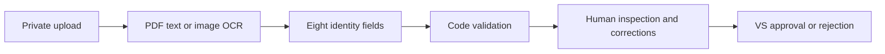

# VS AI behavior and verification

VS AI supports the six capabilities in the enterprise roadmap. It answers in English even when a question uses Hindi, Hinglish or typos. Source names, identifiers and OCR transcripts retain their original text. Normal replies use readable record names and named navigation controls; internal routes, provider names and usage counters are not part of the assistant interface.

## Capabilities

| Capability            | Working behavior                                                                                                                                                                                                                            | Decision owner                                                              |
| --------------------- | ------------------------------------------------------------------------------------------------------------------------------------------------------------------------------------------------------------------------------------------- | --------------------------------------------------------------------------- |
| Workspace assistant   | Answers platform questions, retrieves authorized RFQs/documents/invoices and other records, summarizes data and resolves follow-ups such as “the second RFQ” with current line items. New topics do not reuse an unrelated business report. | The signed-in user opens the relevant permitted action.                     |
| Document intelligence | Secure PDF/PNG/JPEG upload, text reading or image OCR, eight identity fields, format/expiry/profile checks, source-linked history and review corrections.                                                                                   | VS verification explicitly approves or rejects.                             |
| Requirement drafting  | Extracts skills, quantity, location, experience, technology and delivery needs from business/hiring briefs; identifies missing information.                                                                                                 | An authorized user edits and saves a draft through the standard form.       |
| Quotation analysis    | Compares server-calculated totals, tax, discounts, delivery charges/dates, warranty, validity, payment terms and missing commercial information.                                                                                            | The authorized buyer selects and approves through the procurement workflow. |
| Partner discovery     | Searches disclosed industry, category, location, products, services, technology, certifications, capabilities and verification status. Search limits and unsupported claims are explained.                                                  | The user reviews candidate partners in the directory.                       |
| Operational alerts    | Explains document/contract expiry, delivery delay, invoice aging, procurement anomalies, hiring aging and vendor response trends from recorded dates and events.                                                                            | Authorized teams review the evidence and take action.                       |

The assistant never reports an approval, payment, email, invitation or database change it has not performed. AI endpoints provide explanations or reviewable drafts; business mutations remain separate authorized API operations.

## Work done by code

The API owns access checks, organization isolation, status/date filters, exact counts, line-item arithmetic, invoice balances, expiry windows, statistical signals, validation and workflow transitions. Common current-status queries use SQL without a provider request. Less predictable language uses a constrained lookup planner; the server validates its plan and applies the same record scope as ordinary APIs. A planner cannot supply SQL or grant access to a record.

General workspace context excludes candidate/interview/staffing personal details. Those details require an explicitly selected record and current permission. The user's history is private. Source access is checked before provider calls, before saving the answer and when a saved conversation is read. Named navigation actions are also filtered by current permissions.

## Upload and review



The fields are company name, GSTIN, PAN, CIN, registration number, expiry date, certificate type and address. Missing values stay empty. Formatting and profile consistency checks are not government verification. The original extraction and subsequent human corrections remain separate; document questions include the latest review for the same source digest.

Uploads are limited to 10 MB; AI extraction accepts PDFs up to 500 pages. The local reader visits every page and retains up to one million characters, with a per-page budget to avoid silently dropping later pages. Longer text uses labelled excerpts across the document within a 60,000-character AI context. Both analysis and saved-transcript limits are shown in the result. Authorized follow-up questions search the retained text for relevant sections.

Blank pages do not trigger OCR. Image coverage identifies scanned pages even when they contain a selectable header; a small logo on a readable page does not force OCR. Mixed PDFs send only their scanned pages for OCR, together with locally read text. Long OCR transcripts are bounded excerpts and remain subject to inspection of the original. Two readers, an eight-request waiting queue, a 25-second parser deadline and 192 MB worker heap limits bound local work. Password-protected, invalid and oversized PDFs return actionable errors.

The browser receives real server events for upload/read/extract/validate/ready and measured PDF page counts, then displays the separate human review and VS decision stages. The next-step card shows the actual document status and the user's review permission. Original download, extracted text and document questions have separate named controls. Stop cancels pending work. Reduced-motion preferences are respected; no percentage or automatic approval is invented.

Requirement drafts also preserve explicit English work-arrangement constraints and unambiguous labelled ISO dates in code. A known hiring headcount carries into quantity. Negated work arrangements and ambiguous dates are not filled by these rules; the user reviews the full editable draft. This prevents a clearly stated remote-team requirement from disappearing between the AI narrative and the form.

## Reuse, response time and limits

Identical document content reuses the creator's extraction for that document and extraction version, with validation recalculated against the current profile. Requirement, comparison, discovery and alert analyses can reuse the same user's unchanged evidence for 15 minutes. Model, role, permissions, dates, record versions and values participate in the cache key. Changed evidence invalidates reuse. Deleting the conversation removes its saved analysis. Query plans have a bounded five-minute memory cache; SQL always runs again.

The normal request deadline is 60 seconds and document extraction is 90 seconds. Individual provider calls and lookup planning have shorter bounds. Only one provider request per user runs at once. Capacity, cancellation, malformed responses and timeouts produce an honest retry state rather than a substitute answer. Free-provider project limits still apply; this is not a throughput guarantee.

## Reproduce the acceptance evidence

```sh
npm run check
npm test
npm run test:postgres
npm run test:e2e
npm run test:files
GEMINI_VERIFICATION_REPORT=artifacts/local-verification/ai/live-complete.json npm run verify:gemini
npm run report:verification
```

The API suite uses controlled provider responses to test permission changes, malformed output, cancellation, caching, source validation and human review. Browser tests reproduce typing, Stop/Retry, real upload storage, controlled server progress and saved-history presentation. The live suite separately calls the configured Google service for real language responses and OCR using generated QA files. It spaces requests to respect project rate limits; its reported task timings exclude that test-only pacing. Fixture names identify their test purpose and all test databases are disposable.

The report command reads completed evidence files; it does not mark missing or failed checks as passed. See [VERIFICATION.md](VERIFICATION.md) for observed results and deployment limits.
