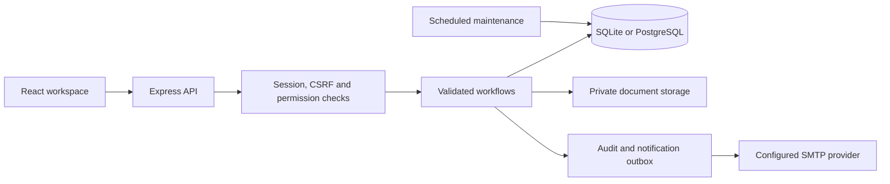
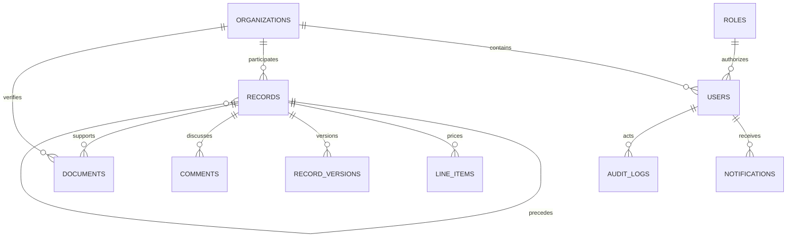

# Architecture

## Request path

The React application uses the same-origin `/api` surface. Vite proxies it during development; Express serves compiled frontend assets in production. There are no client-side secret keys or simulated database writes.

## Application boundaries

- `shared/domain.ts` defines the supported organization types, module vocabulary, role defaults and status transitions. The server narrows role permissions by organization type and relationship to each record.
- `server/auth.ts` and `server/security.ts` manage credentials, sessions, verification, optional email sign-in codes, CSRF and permission checks.
- `server/record-service.ts` validates module payloads, establishes ownership, validates parent relationships and computes commercial data. `server/workflows.ts` enforces status transitions and their prerequisites.
- `server/organizations.ts` owns profiles, discovery and VS verification. `server/documents.ts` checks authorization on both uploads and downloads.
- `server/events.ts` writes transaction-linked audit entries and notifications. SMTP delivery is asynchronous and retryable. `server/maintenance.ts` handles expiry reminders, expired credentials and configured candidate retention.
- React forms and actions reflect the server's `allowed_transitions` and `can_edit` results. Hiding a button is never the authorization boundary.

## Data model

Organizations, users, roles, sessions, auth tokens, invitations, records, line items, record invitations, versions, comments, documents, notifications, email outbox, audit logs, settings and sequences are persisted in relational tables.

Business records share a typed `kind` and a validated JSON payload. Relationship, ownership, status, currency, amount, sequence number and version are normalized/indexed columns. This makes connected workflow queries consistent without duplicating access-control logic for every module. Payload validation remains specific to each module.

Timestamps are UTC ISO-8601 strings for consistent behavior on both databases. Dates such as delivery dates are date-only values. Money is stored as integer minor units; percentage values use basis points. `Decimal.js` calculates and rounds totals. No currency conversion is performed; dashboards filter monetary totals by currency.

## Concurrency and consistency

Mutations use transactions and a record `version`. A stale edit receives HTTP 409. Record numbering uses an atomic sequence increment. Unique database keys enforce one quotation per partner/RFQ, one order per approved quotation and one invoice per billing source. Supplier invoice references, buyer transaction references and organization SKUs are normalized and unique within their scopes.

The invoicing/payment workflow locks the invoice through its version while reserving pending amounts. Only completed payments reduce outstanding balances; pending/processing payments still reserve spend capacity. Marking the final payment complete moves the invoice to paid in the same transaction.

Documents are staged under random filenames outside the public directory. Metadata and versions are authorized before download. A unique predecessor constraint prevents two renewals from branching from the same document version.

## Access model

Internal users belong to a VS role and can work across organizations only in their permitted modules. External users belong to exactly one organization and one role. Organization type further limits modules; record visibility depends on ownership, buyer/supplier participation, recruitment assignment or explicit invitation.

An external buyer sees verified public company capabilities through discovery, with private KYC and contact fields removed. A supplier cannot read another supplier's financial records or KYC. Pending or suspended organizations cannot transact. Company legal-identity changes require renewed verification.

## Runtime model

The supplied deployment runs one application process and one PostgreSQL database, with persistent private upload storage. SQLite is suitable for the local demo and smaller single-process installations. The app starts migrations, seeds only in demo mode, serves requests and runs email/maintenance timers.

Before running multiple application replicas, move maintenance to a designated worker, provide shared private storage and replace per-process rate limiting with a distributed store. Keep schema migrations as a controlled deployment step. The PostgreSQL adapter is verified by the same integration suite as SQLite; this is not a load-capacity benchmark.
