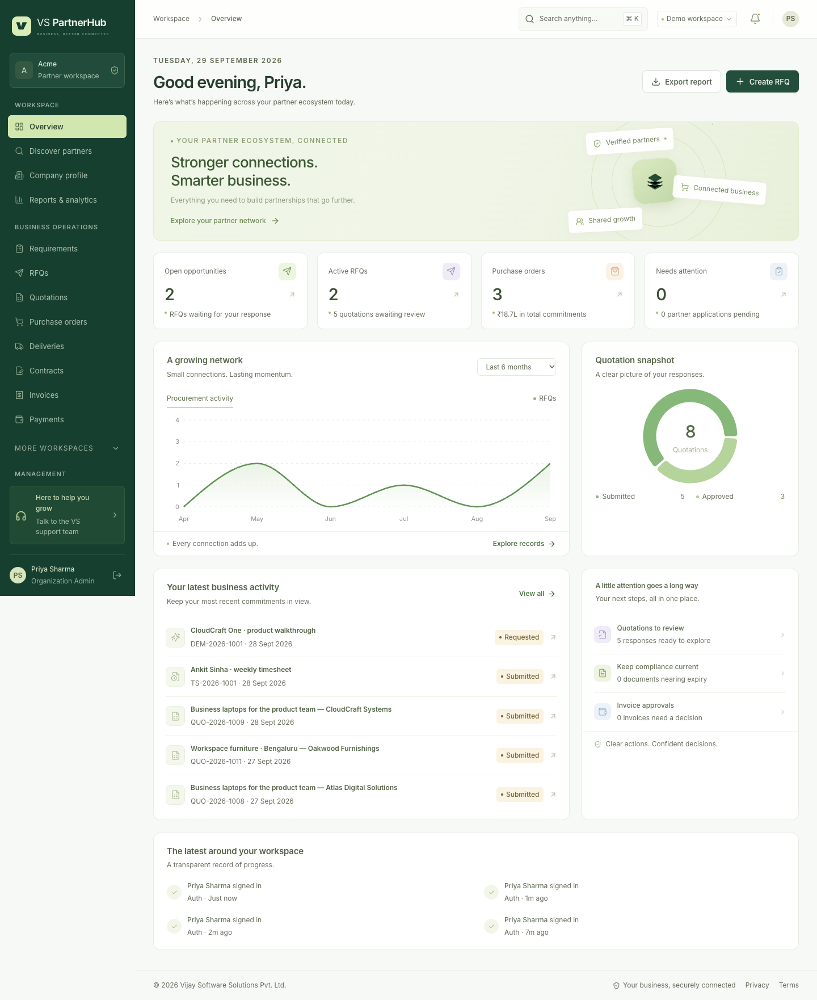
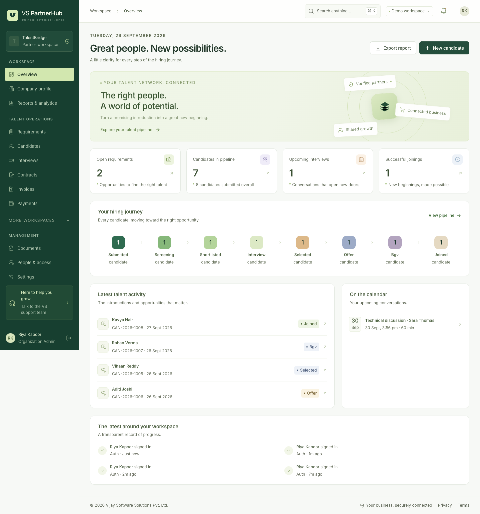

# Local review guide

Run `npm run dev` and open **http://localhost:5173/login?demo=true**. Use the **Demo workspace role** dropdown to switch personas. These accounts, company names and documents are fictional. Business changes made in this review workspace persist across restarts; automated tests use separate disposable data.

See [recorded verification results](VERIFICATION.md) for the checks completed before delivery.

## 1. Super Admin and verification

Choose **Super Admin**. Start with the overview's KPIs, registration trend and partner distribution. Change the date/currency filters and follow a KPI/drill-down link.

Open **Partner directory**, filter by organization type/status, search for a company and open its profile. Review Company overview, Capabilities, Products & services and Documents & KYC. **Discover partners** shows the verified discovery view.

In **Verification center**, open a pending company. Inspect/download its sample PAN and incorporation documents before approving them. Use **Verification decision** to approve the organization or request clarification with a note. The organization cannot transact until its email and mandatory documents are verified.

For a fresh onboarding example, open `/register` in a separate private browser window. Select Recruitment Company, Supplier or Client / Buyer to see different business fields. Upload two sample PDFs/images, accept the terms and submit. The local verification code appears on the verification screen. After email verification, approve the company/documents from the VS verification workspace.

## 2. Complete procurement



1. Choose **Client / Buyer**. Create a procurement Requirement with a line item, then move it to Open.
2. Create an RFQ from that requirement. Enter delivery address, deadline and required date; invite **Nexora** (vendor) or **Meridian** (supplier). Publish it.
3. Choose the invited Vendor/Supplier. Open the RFQ and select **Submit a quotation**. Add unit prices, discount/tax, delivery terms and validity. Submit the quotation.
4. Return to Buyer. Open **Compare quotations**, inspect commercials and approve the chosen quote. Create its purchase order; request approval, approve and send it. High-value orders require a second authorized approver.
5. Return to Vendor/Supplier. Acknowledge the PO, add delivery and advance it through dispatch/transit/delivered.
6. Return to Buyer. Confirm the delivery. The order becomes fulfilled.
7. Return to Vendor/Supplier and create an invoice from the fulfilled order. Enter its supplier invoice number and dates; submit it.
8. Choose **Finance Team**. Review/approve the invoice, then record a bank payment reference, transaction ID and amount. Complete it. A partial payment leaves a balance; the final payment marks the invoice paid.
9. Open each record's conversation, documents and history tabs. Every decision is traceable.

The seeded **Ergonomic chairs for Hyderabad office** order is already fulfilled and has a partially paid invoice. **Network security upgrade** shows a fully paid VS procurement chain. These are useful read-only examples before creating a new transaction.

## 3. Recruitment and staffing



Choose **Recruitment**. Open an assigned hiring requirement, select **Submit candidate**, supply relevant skills/experience/contact details and confirm candidate consent. Attach a resume in the candidate's Documents tab.

Choose **HR & Recruitment**. Move that candidate through screening and shortlist. Schedule an interview from the candidate, enter the interview date/time, interviewer and meeting details. Complete feedback/recommendation before marking the interview completed and selecting the candidate.

Enter offer date/compensation before Offer. Move to BGV, record clearance before Onboarding, and enter joining date before Joined. Missing prerequisites produce an actionable error instead of allowing an incomplete stage.

Choose **Staffing** to review engagements and submit a timesheet against an active engagement. The buyer/HR team approves it. Overlapping timesheet periods are rejected.

## 4. Other partner workspaces

| Persona                  | Review                                                                                                      |
| ------------------------ | ----------------------------------------------------------------------------------------------------------- |
| Supplier                 | Product catalog, SKU, MOQ, stock availability, price, lead time, warranty and delivery locations            |
| Service Provider         | Service catalog, proposals/quotations, active contracts, service milestones, invoices and performance       |
| Technology Partner       | Technology catalog, documentation/APIs/integration descriptions, certifications and scheduled demo requests |
| Business Partner / Other | Profile, supporting documents, relevant opportunities and commercial records                                |
| Finance                  | Invoice queues, partial/outstanding balances and payment references                                         |
| Management               | Reports, date/currency filters, registration/transaction/hiring activity and exports                        |
| Support                  | Assigned tickets, conversations, resolution notes and status updates                                        |

Expand **More workspaces** in navigation when a secondary module is collapsed.

## 5. Security, people and notifications

In **People & access**, invite a teammate with a suitable external role. Local mode displays a one-time invitation link; open it in a private window and create the account. Confirm its narrower navigation/access. Internal roles can only be assigned by authorized VS staff.

In **Settings → Password & security**, enable email sign-in verification with the current password. Sign out and sign back in; a password alone now produces an email-code challenge. The local demo displays the code. Disable it again if desired after testing.

Review **Roles & permissions**, **Audit trail**, **Notifications**, **Settings → Platform configuration** and **Email delivery** as Super Admin. Notification preferences affect business email; security verification/recovery emails remain required. Unconfigured local SMTP records messages without sending them externally.

Create a Support ticket, add a conversation entry, resolve it from Support and inspect the organization user's notifications. Use the top search button or **Cmd/Ctrl+K**. Escape closes dialogs and returns keyboard focus to the invoking control.

## 6. Independent automated verification

```sh
npm run check
npm test
npm run test:postgres
npm run test:e2e
npm run test:production
npm run audit:accessibility
npm run preview:audit
```

The PostgreSQL helper requires PostgreSQL binaries; set `PG_BIN` if they are outside the default Homebrew location. Browser tests launch isolated app instances on ports 5183/4103. The production smoke uses port 4105 and temporary data. Keep those ports available.

Accessibility/preview audits use the existing demo at port 5173. Screenshots and machine-readable reports are generated under `artifacts/local-verification/`. Browser failure traces appear in `test-results/`. These generated files and all local data are ignored by Git.

The application does not transfer real funds or perform government/BGV provider checks during this walkthrough. Real emails require the configured sender/provider. See [requirements and limits](REQUIREMENTS.md) and [deployment instructions](DEPLOYMENT.md) for production operation.
